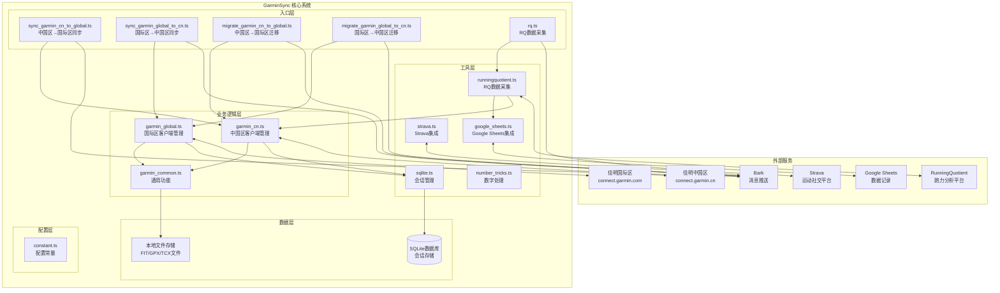
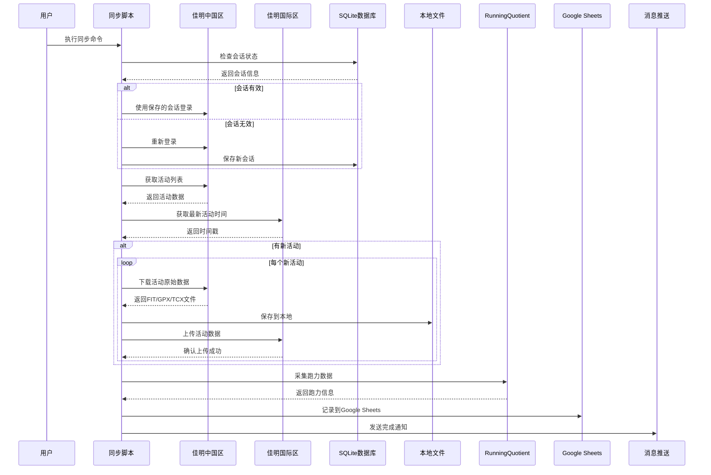

# GarminSync 项目架构设计报告

**仓库地址**: https://github.com/yanzhitao/garmin-daily-sync

## 项目概述

GarminSync 是一个用于佳明运动数据同步与采集的 TypeScript 项目，主要功能是在佳明中国区服务器和国际区服务器之间进行运动数据的双向同步，同时支持数据迁移、Strava 同步、RQ（RunningQuotient）数据采集和 Google Sheets 数据记录等功能。

## 系统架构图



## 数据流图



## 目录结构分析

### 根目录文件
- `package.json`: 项目配置和依赖管理
- `tsconfig.json`: TypeScript 编译配置
- `README.md`: 项目说明文档
- `LICENSE.txt`: GPL-3.0 开源许可证

### src/ 目录结构

#### 核心入口文件
1. **`index.ts`**: 主入口文件（当前为空）
2. **`constant.ts`**: 全局配置常量
   - 文件格式定义（FIT、GPX、TCX）
   - 佳明账号配置（中国区/国际区）
   - Google Sheets 配置
   - RQ 平台配置
   - Strava 配置
   - Bark 推送配置

#### 主要功能模块
1. **`sync_garmin_cn_to_global.ts`**: 中国区到国际区同步
2. **`sync_garmin_global_to_cn.ts`**: 国际区到中国区同步
3. **`migrate_garmin_cn_to_global.ts`**: 中国区到国际区历史数据迁移
4. **`migrate_garmin_global_to_cn.ts`**: 国际区到中国区历史数据迁移
5. **`rq.ts`**: RQ 数据采集入口

#### utils/ 工具模块

##### 佳明相关工具
1. **`garmin_cn.ts`**: 佳明中国区客户端管理
   - `getGaminCNClient()`: 获取中国区客户端实例
   - `migrateGarminCN2GarminGlobal()`: 迁移中国区数据到国际区
   - `syncGarminCN2GarminGlobal()`: 同步中国区数据到国际区
   - 会话管理和自动重连机制

2. **`garmin_global.ts`**: 佳明国际区客户端管理
   - `getGaminGlobalClient()`: 获取国际区客户端实例
   - `migrateGarminGlobal2GarminCN()`: 迁移国际区数据到中国区
   - `syncGarminGlobal2GarminCN()`: 同步国际区数据到中国区
   - 会话管理和自动重连机制

3. **`garmin_common.ts`**: 佳明通用功能
   - `uploadGarminActivity()`: 上传活动数据
   - `downloadGarminActivity()`: 下载活动原始数据
   - `getGarminStatistics()`: 获取运动统计数据
   - 支持 FIT、GPX、TCX 格式文件处理

##### 数据存储工具
4. **`sqlite.ts`**: SQLite 数据库管理
   - `initDB()`: 初始化数据库
   - `saveSessionToDB()`: 保存会话信息
   - `updateSessionToDB()`: 更新会话信息
   - `getSessionFromDB()`: 获取会话信息
   - `encryptSession()`/`decryptSession()`: 会话加密/解密

##### 第三方服务集成
5. **`strava.ts`**: Strava 平台集成
   - `getStravaUserInfo()`: 获取 Strava 用户信息
   - 配置 Strava API 认证

6. **`runningquotient.ts`**: RunningQuotient 数据采集
   - `doRQGoogleSheets()`: 执行 RQ 数据采集并写入 Google Sheets
   - `getRQOverView()`: 获取 RQ 跑力数据
   - `rqRegexp()`: 解析 RQ 页面数据

7. **`google_sheets.ts`**: Google Sheets 集成
   - `insertDataToSheets()`: 插入数据到 Google Sheets
   - `getLatestSheetsData()`: 获取最新数据
   - `getLatestActivityIdInSheets()`: 获取最新活动ID

##### 辅助工具
8. **`number_tricks.ts`**: 数字处理工具
   - `number2capital()`: 数字转中文大写

9. **`type.ts`**: 类型定义
   - `GarminClientType`: 佳明客户端类型定义

### assets/ 目录
包含项目相关的图片资源，用于文档说明和界面展示。

### db/ 目录
- `garmin.db`: SQLite 数据库文件，用于存储会话信息

## 核心功能实现

### 1. 数据同步机制

#### 双向同步策略
- **中国区 → 国际区**: 检查中国区最新活动，同步到国际区
- **国际区 → 中国区**: 检查国际区最新活动，同步到中国区
- **时间戳比较**: 通过比较最新活动时间判断是否需要同步
- **增量同步**: 只同步新增的活动数据

#### 会话管理
- 使用 SQLite 数据库持久化存储登录会话
- AES 加密保护会话信息安全
- 自动检测会话有效性，失效时自动重新登录
- 支持中国区和国际区独立会话管理

### 2. 数据迁移功能

#### 批量迁移
- 支持指定迁移数量和起始位置
- 支持全量历史数据迁移
- 支持按活动类型过滤（如只迁移跑步数据）

#### 文件格式支持
- **FIT**: 佳明原生格式，包含完整运动数据
- **GPX**: GPS 交换格式，包含轨迹信息
- **TCX**: Training Center XML，包含训练数据

### 3. 第三方平台集成

#### RunningQuotient 集成
- 自动采集跑力数据
- 解析网页数据获取训练指标
- 与 Google Sheets 联动记录数据

#### Google Sheets 集成
- 使用 JWT 认证访问 Google Sheets API
- 自动记录运动数据和跑力指标
- 支持数据去重和增量更新

#### Strava 集成
- 支持 Strava 账号关联
- 通过佳明国际区自动同步到 Strava

### 4. 错误处理和通知

#### 异常处理
- 使用 `@actions/core` 进行错误处理
- 支持 GitHub Actions 环境
- 详细的错误日志记录

#### 消息推送
- 集成 Bark 推送服务
- 同步成功/失败状态通知
- 支持自定义推送消息

## 技术栈分析

### 核心技术
- **TypeScript**: 主要开发语言
- **Node.js**: 运行时环境
- **SQLite**: 本地数据存储

### 主要依赖
- **@gooin/garmin-connect**: 佳明 Connect API 客户端
- **axios**: HTTP 请求库
- **crypto-js**: 加密解密功能
- **googleapis**: Google API 客户端
- **strava-v3**: Strava API 客户端
- **sqlite3**: SQLite 数据库驱动

### 开发工具
- **ts-node**: TypeScript 直接运行
- **nodemon**: 开发时自动重启
- **@types/node**: Node.js 类型定义

## 配置管理

### 环境变量支持
项目支持通过环境变量和配置文件两种方式管理配置：

1. **环境变量**: 优先使用环境变量，适合 CI/CD 环境
2. **常量文件**: `constant.ts` 中的默认值作为后备

### 关键配置项
- 佳明中国区/国际区账号密码
- Google Sheets API 认证信息
- RQ 平台认证信息
- Strava API 配置
- Bark 推送密钥

## 部署和运行

### 本地运行
```bash
# 安装依赖
yarn install

# 配置账号信息
# 编辑 src/constant.ts 文件

# 运行同步
yarn sync_cn        # 中国区到国际区
yarn sync_global    # 国际区到中国区

# 运行迁移
yarn migrate_garmin_cn_to_global    # 迁移中国区到国际区
yarn migrate_garmin_global_to_cn    # 迁移国际区到中国区

# 运行RQ数据采集
yarn rq
```

### GitHub Actions 部署
项目支持通过 GitHub Actions 进行自动化部署和定时执行，适合云端运行。

## 安全考虑

### 数据安全
- 会话信息使用 AES 加密存储
- 敏感配置通过环境变量管理
- 支持 GitHub Secrets 安全存储

### 网络安全
- 支持代理和科学上网环境
- 网络连通性检测机制
- 请求频率控制避免被限制

## 扩展性设计

### 模块化架构
- 清晰的模块分离
- 易于添加新的第三方平台集成
- 支持自定义数据处理器

### 配置灵活性
- 支持多种配置方式
- 易于适配不同环境需求
- 支持自定义同步策略

## 总结

GarminSync 是一个设计良好的运动数据同步工具，具有以下特点：

1. **功能完整**: 支持双向同步、数据迁移、第三方平台集成
2. **架构清晰**: 模块化设计，职责分离明确
3. **安全可靠**: 会话管理、错误处理、数据加密
4. **易于使用**: 支持多种部署方式，配置简单
5. **可扩展**: 模块化设计便于功能扩展

该项目为佳明用户提供了便捷的数据同步解决方案，解决了不同区域服务器之间的数据隔离问题，同时集成了多个运动数据分析平台，形成了完整的运动数据生态。